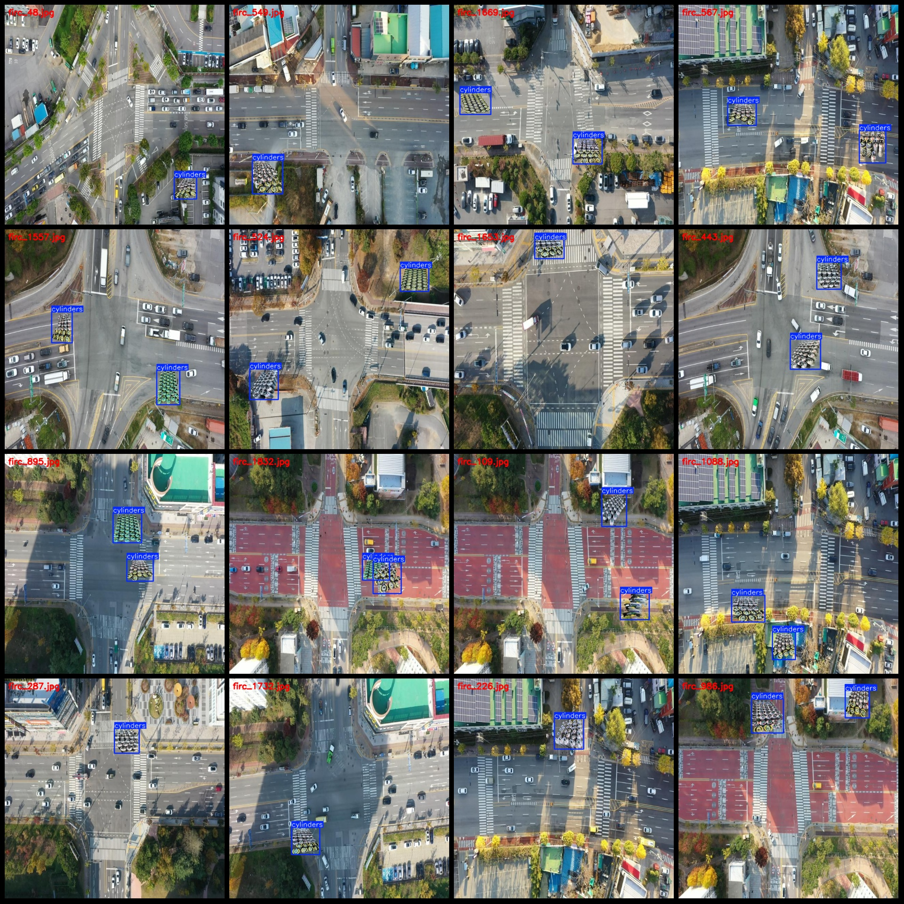
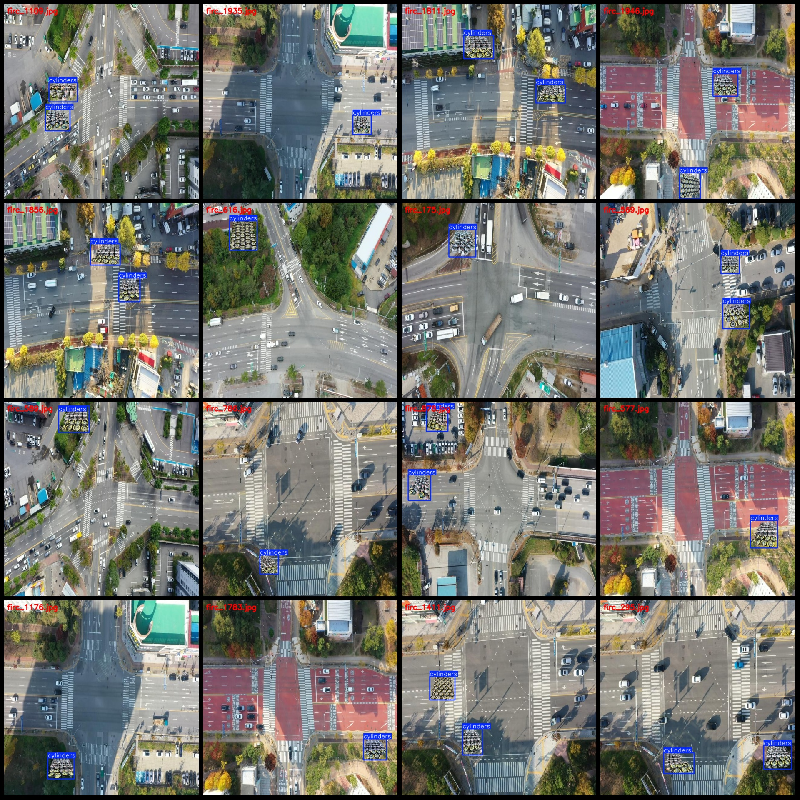

# Drone Viewpoint of Outdoor Illegally Stacked Gas Tanks and Flammable and Explosive Goods Detection Data Set in VOC+YOLO Format

Please note that this dataset is a compilation version, meaning it is composed by randomly pasting stacked gas tanks onto background images. For specific details, please refer to the images.

The format of the dataset includes both Pascal VOC and YOLO (without the split path in txt files, only including jpg images along with corresponding VOC xml files and YOLO txt files).

Number of images (in jpg format): 1958
Number of labels (in xml files): 1958
Number of labels (in txt files): 1958
Number of categories: 1
Category name for labelling: "cylinders"
Number of bounding boxes per category: 2928
Total number of bounding boxes: 2928
Number of images per category: 1958
Image resolution: 640x640
Labelling tool used: labelImg
Labelling rules: draw bounding boxes for each category
Important notice: The dataset does not have been divided into training, validation, or test sets and needs to be manually divided.
Special declaration: This dataset does not guarantee any accuracy in training models or weight files.
Image preview:
Labelling examples:

## Images

Here is a pay link on Stripe ( https://buy.stripe.com/3cs8yP7sY87d0vu9AB ). Please contact me lonlonago@foxmail.com after funding $89, and I will send you a complete data files , thank you!

